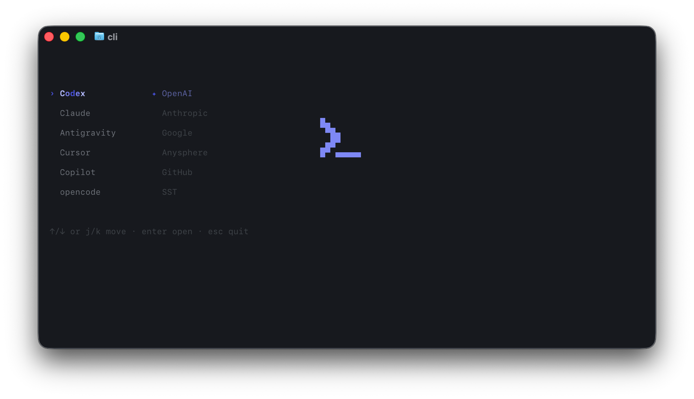

# summon-cli

<p align="center">
  
</p>

Terminal launcher for local AI CLIs. Run `summon`, pick a tool, launch it.

Supported: Codex CLI, Claude Code, Antigravity CLI, Cursor CLI, GitHub Copilot CLI, opencode CLI. Missing tools show dimmed.

> Pre-release (0.1.0).

## Install

```sh
npm install -g summon-cli
summon
```

Move with arrows or `j/k` or `1-9`. `Enter` launches, `Esc` quits.

## Commands

- `summon` open the picker (or your default)
- `summon menu` always open the picker
- `summon reorder` set the order
- `summon default <tool>` launch one directly (`off` clears, no arg = pick)
- `summon alias <name>` add another command name (e.g. `summon alias cli`)
- `summon help`

Flag: `--no-logo`. Args after `--` go to the launched tool.

## Config

`~/.config/summon-cli/config.json`

## Requirements

Node 18+, a TrueColor terminal, the target CLIs on PATH.

## Trademarks

Unofficial, not affiliated with Codex CLI, Claude Code, Antigravity CLI, Cursor CLI, GitHub Copilot CLI, opencode CLI or their makers. Names, logos, colors belong to their owners and are used only to identify what you launch. Open an issue to request changes.

## License

GPL-3.0-only. See [LICENSE](LICENSE). Copyright (c) 2026 sk1gl4a.
